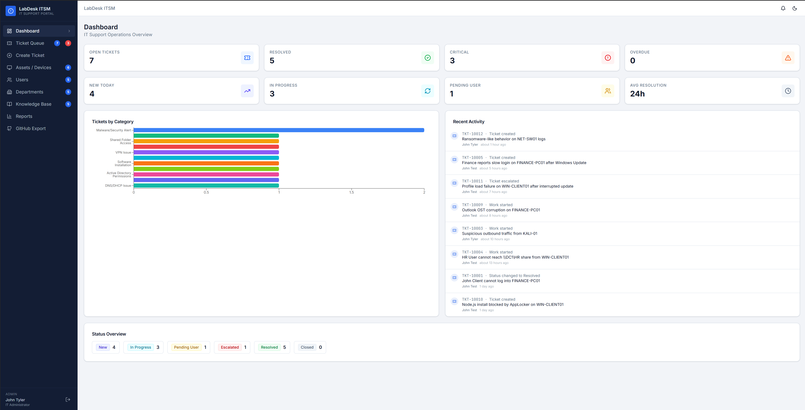
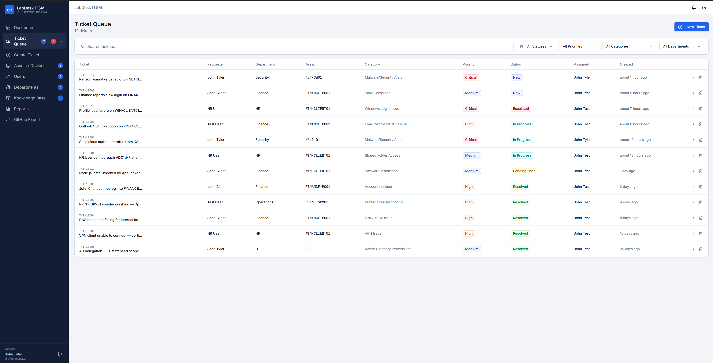
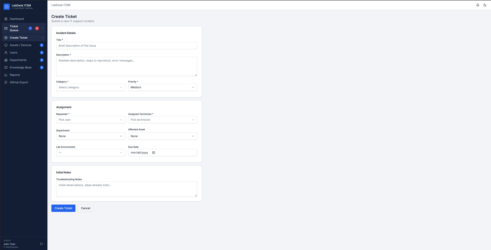
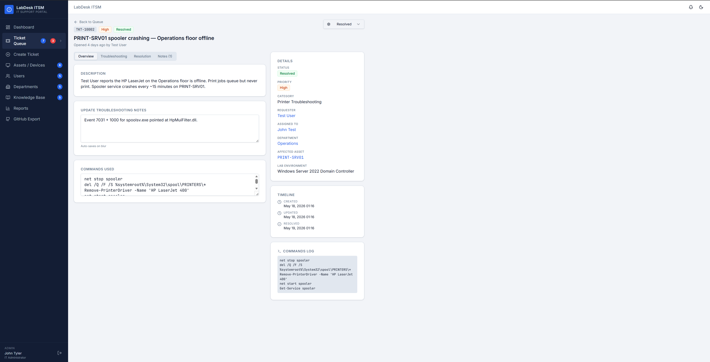
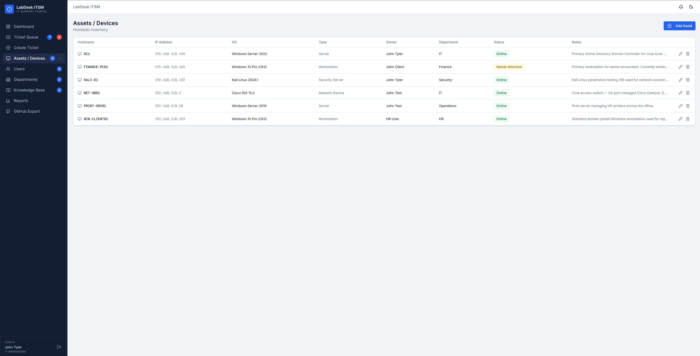
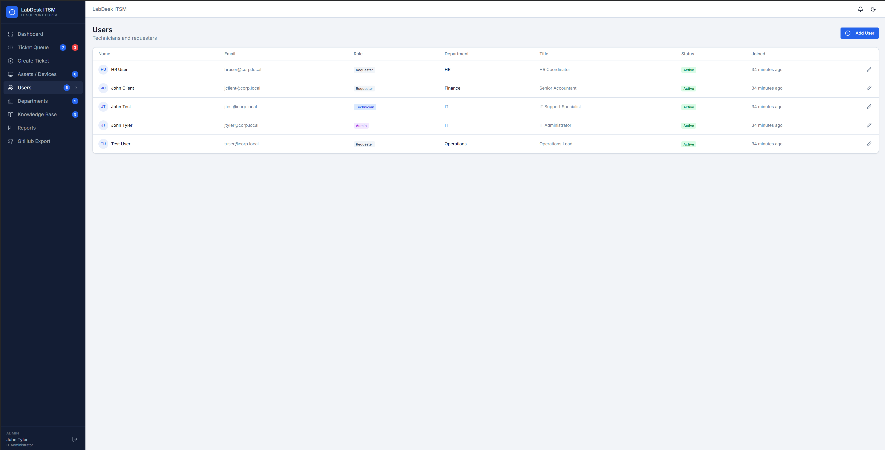
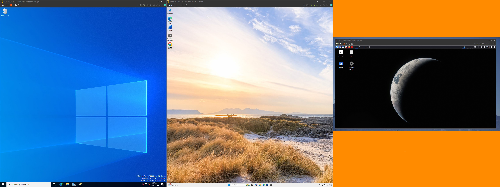
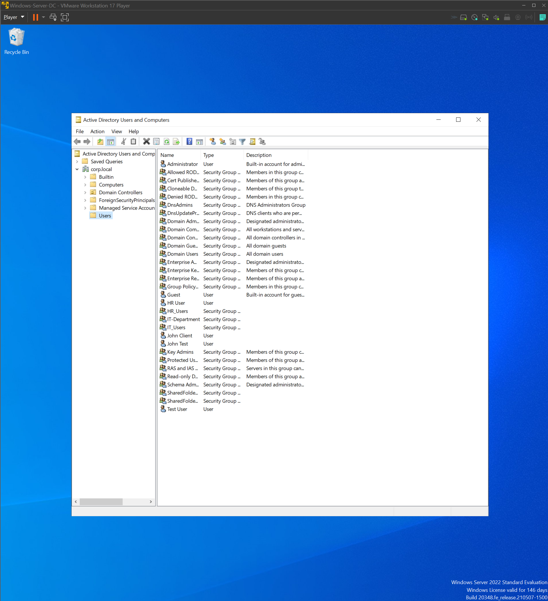
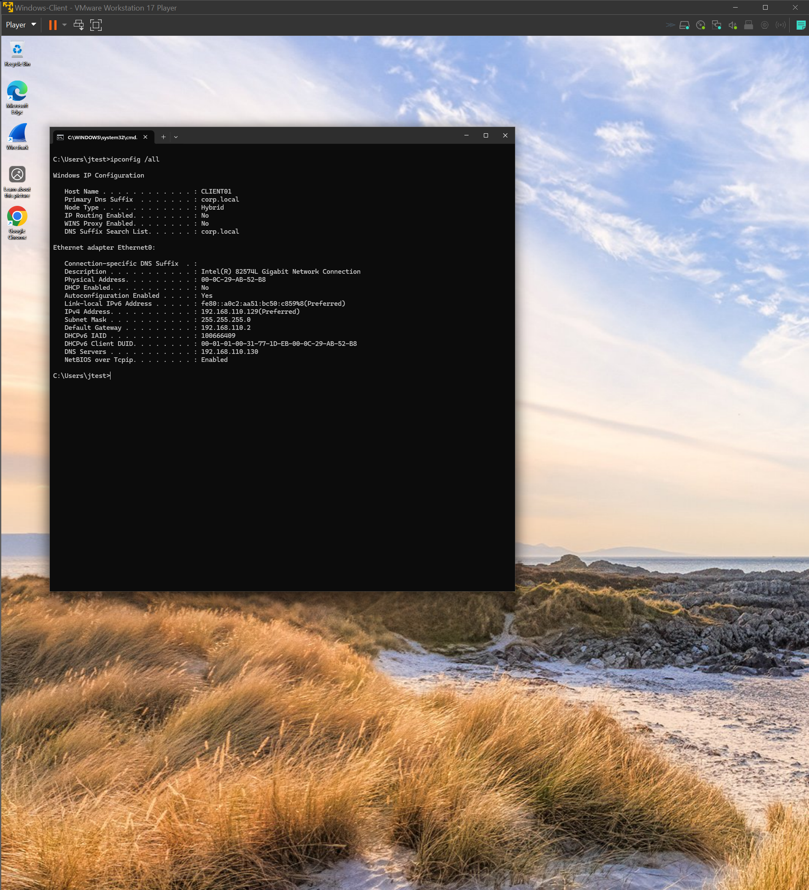
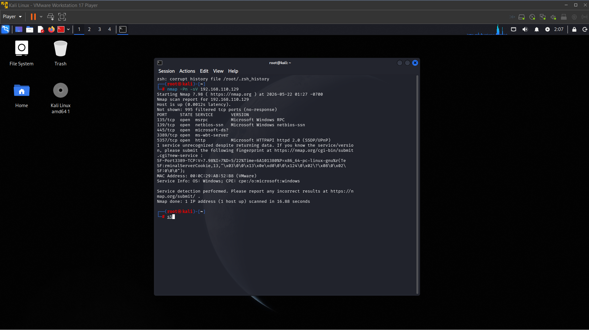

# LabDesk ITSM Homelab

## Overview

LabDesk ITSM is a simulated enterprise help desk and IT service management platform built to document and practice real-world Tier 1 IT support workflows. The project connects users, departments, tickets, and assets inside a realistic service desk environment.

This lab was created to demonstrate practical IT support skills using a VMware homelab, Windows Server 2022, Active Directory, Windows client machines, Kali Linux, asset tracking, ticket resolution, and structured troubleshooting documentation.

## Lab Setup

- VMware Workstation
- Windows Server 2022 Domain Controller
- Windows 10 Pro Client
- Kali Linux
- Simulated ITSM web application
- Internal network: 192.168.110.x
- Domain: corp.local

## Tools Used

- Windows Server 2022
- Active Directory Users and Computers
- Windows 10 Pro
- Kali Linux
- VMware Workstation
- Nmap
- Replit
- GitHub
- ITSM ticketing workflow

## Features Built

- Ticket queue
- Ticket detail pages
- User profiles
- Asset inventory
- Department tracking
- Ticket history
- Priority and status badges
- Technician assignment
- Resolution notes
- Activity logs
- Knowledge base section
- GitHub export page

## Administrative Role

Within this simulated enterprise environment, I acted as the IT Administrator responsible for:

- Managing Active Directory users and systems
- Maintaining asset inventory
- Handling ticket assignment and escalation
- Troubleshooting workstation and network issues
- Simulating help desk workflows
- Documenting incidents and resolutions
- Monitoring systems within the VMware lab environment

## Ticket Workflow Examples

| Ticket | User | Department | Asset | Status |
|---|---|---|---|---|
| Printer offline | Test User | Operations | PRINT-SRV01 | Open |
| Login issue | John Client | Finance | WIN-CLIENT01 | In Progress |
| Shared folder access request | HR User | HR | DC1 | Open |
| Workstation cannot reach domain controller | John Test | IT | WIN-CLIENT01 | Escalated |
| Suspicious outbound traffic | John Tyler | Security | KALI-01 | Open |

## Screenshots

### Dashboard

### Ticket Queue

### Create Ticket

### Ticket Detail

### Assets and Devices

### Users

### VMware Lab

### Active Directory Users

### Windows Client IP Configuration

### Kali Nmap Scan

## Skills Demonstrated

- Tier 1 help desk workflow
- Ticket documentation
- Asset management
- User and department tracking
- Active Directory support
- Windows client troubleshooting
- Network troubleshooting
- Printer support workflow
- Security ticket triage
- Escalation documentation
- GitHub technical documentation

## Key Takeaways

This project demonstrates how a realistic IT support environment connects users, assets, departments, and tickets. It also shows the ability to document troubleshooting steps, manage support workflows, and understand how internal IT teams track incidents and service requests.

## Conclusion

LabDesk ITSM was built as a practical IT support portfolio project to show hands-on understanding of help desk operations, Active Directory, asset management, ticketing systems, and troubleshooting workflows.
